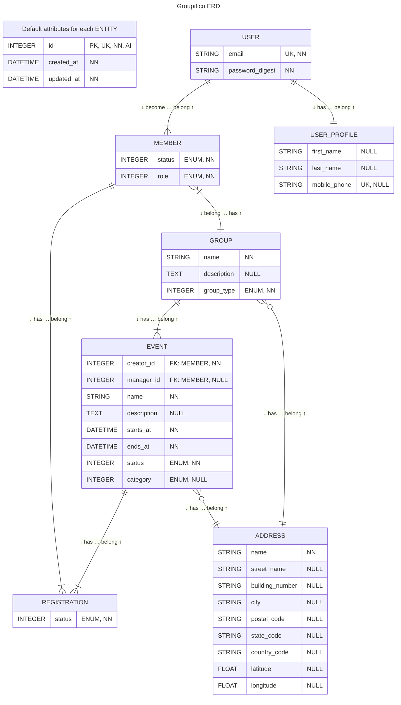

# What is Groupifico?

Groupifico is an online place where you can manage the essential chores of your group. 😊

Your group being:
1) **CHOIR**
2) **BAND**
3) Or any other **GROUP** of people doing something together

## What chores?

Groupifico is strictly focused on managing fundamental parts of your group:

- Members
- Events

_Coming soon:_
- Links
- Notifications
- Documents (e.g. Songbook)
- Polls (quick and easy feedback)
- Membership fees (Treasury)

For more information, check out the detailed [roadmap](./docs/ROADMAP.md).

## Architecture

### Web framework

- Plain and simple Ruby on Rails web app with mobile first interface
- ERB + partials + layout
- DaisyUI

### Core Domain Models

#### Group
- Multi-tenancy is achieved via Groups

#### User
- Global application identity via unique email
- User logs in with an email and password, and the session persists until signed out
- User can become a Member of one or more Groups

#### Member aka _Group membership_
- Members belong to the Group and have status and role
- They can create/interact with Events, Polls, etc.

#### Event
- Main organizational group entity

#### Registration
- Member registers for an Event
- Member can be invited to an Event and respond
- A registration can be reserved and the presence later confirmed

### Other Domain Models

#### Address
- Fields according to [ISO 20022 PostalAddress type](https://www.iso20022.org/standardsrepository/type/PostalAddress28)

### Entity Relationship Diagram

The diagram renders only what is needed to read the schema: entity, attribute, type, key and nullability. Everything else about a column, its limit, its enum options, its default and its foreign key rules, sits in a `%%` comment in the source of this file directly above the line it describes, and never reaches the picture. So read the rendered diagram for the shape, the source of this section for the detail, and the Rails [schema.rb](./db/schema.rb) for the authority.

Attributes read `type name "key, comment"`, which is mermaid's own order, with the keys inside the comment rather than as native mermaid keys so that every entity box stays two columns wide. The reasoning behind that and every other choice here is [ADR 0002](./docs/adr/2026-08-21_erd-notation-conventions_0002.md).

| Token | Meaning |
|---|---|
| `PK` | Primary key |
| `UK` | Unique key, backed by a unique index |
| `FK: ENTITY` | Foreign key pointing at that entity, shown only where no relationship line does |
| `ENUM` | Integer column backed by an Active Record enum; its options and default are in the `%%` comment above it |
| `NN` | `NOT NULL`, the column is required |
| `NULL` | The column is nullable |
| `AI` | Auto-increment |

> [!IMPORTANT]
> - Foreign key attributes are omitted where a relationship line already shows the link. `creator_id` and `manager_id` are the exception, because both point at `MEMBER` so their names cannot say where they point, and neither has a database constraint behind it.
> - The `sessions` table is not drawn. Authentication gets its own diagram once passwordless login lands, rather than crowding this one.
> - Column limits are Rails-level facts. SQLite does not enforce a declared length, so a limit is what the model validations are set from and what a move to another database engine would need, not a constraint the database applies.

```mermaid
---
title: Groupifico ERD
# IMPORTANT!
# - Official syntax for entity attributes is: `type name key "comment"`
# - Syntax for entity attributes used below: `type name "key, comment"`
---

erDiagram
  direction TB

  %% DEFAULT ATTRIBUTES
  "Default attributes for each ENTITY" {
    INTEGER  id         "PK, UK, NN, AI"
    DATETIME created_at "NN"
    DATETIME updated_at "NN"
  }

  %% RELATIONSHIPS
  USER    1   to  1+  MEMBER        :  "↓ become … belong ↑"
  USER    1   to  1   USER_PROFILE  :  "↓ has    … belong ↑"
  MEMBER  1+  to  1   GROUP         :  "↓ belong … has ↑"
  GROUP   1   to  1+  EVENT         :  "↓ has    … belong ↑"
  EVENT   1   to  1+  REGISTRATION  :  "↓ has    … belong ↑"
  MEMBER  1   to  1+  REGISTRATION  :  "↓ has    … belong ↑"
  GROUP   0+  to  1   ADDRESS       :  "↓ has    … belong ↑"
  EVENT   0+  to  1   ADDRESS       :  "↓ has    … belong ↑"

  %% ENTITIES

  %% UNIQUE INDEX (email)
  %% FK: user_profiles and members reference users, ON DELETE CASCADE, ON UPDATE CASCADE
  %% FK: sessions references users with no options, so NO ACTION; has_many dependent: :destroy cleans them up
  USER {
    %% email limit: 250 chars. Normalised to stripped lowercase, uniqueness validated case-insensitively
    STRING email           "UK, NN"
    %% password_digest holds the bcrypt hash from has_secure_password. No limit declared
    STRING password_digest "NN"
  }

  %% UNIQUE INDEX (user_id), UNIQUE INDEX (mobile_phone)
  %% FK: user_id references users, ON DELETE CASCADE, ON UPDATE CASCADE
  USER_PROFILE {
    %% first_name limit: 250 chars
    STRING first_name   "NULL"
    %% last_name limit: 250 chars
    STRING last_name    "NULL"
    %% mobile_phone limit: 50 chars
    STRING mobile_phone "UK, NULL"
  }

  %% FK: address_id references addresses, ON DELETE RESTRICT, ON UPDATE CASCADE
  GROUP {
    %% name limit: 250 chars
    STRING  name        "NN"
    %% description limit: 100000 bytes at the column, validated at 25000 chars in the model
    TEXT    description "NULL"
    %% ENUM group_type options: general | choir | band. Default: choir
    INTEGER group_type  "ENUM, NN"
  }

  %% UNIQUE INDEX (user_id, group_id): a User cannot become a Member of the same Group twice
  %% FK: user_id and group_id both ON DELETE CASCADE, ON UPDATE CASCADE
  MEMBER {
    %% ENUM status options: active | paused | inactive. Default: active
    INTEGER status "ENUM, NN"
    %% ENUM role options: owner | member | admin | manager. Default: member
    INTEGER role   "ENUM, NN"
  }

  %% FK: group_id ON DELETE CASCADE, address_id ON DELETE RESTRICT, both ON UPDATE CASCADE
  %% FK: creator_id and manager_id have no database constraint, they are Active Record associations only
  EVENT {
    INTEGER  creator_id  "FK: MEMBER, NN"
    INTEGER  manager_id  "FK: MEMBER, NULL"
    %% name limit: 250 chars
    STRING   name        "NN"
    %% description limit: 100000 bytes at the column, validated at 25000 chars in the model
    TEXT     description "NULL"
    DATETIME starts_at   "NN"
    %% ends_at is validated greater_than starts_at
    DATETIME ends_at     "NN"
    %% ENUM status options: unconfirmed | confirmed | concluded | canceled. Default: unconfirmed
    INTEGER  status      "ENUM, NN"
    %% ENUM category options: other | rehearsal | gig. Default: other
    INTEGER  category    "ENUM, NULL"
  }

  %% UNIQUE INDEX (member_id, event_id): a Member cannot register for the same Event twice
  %% FK: member_id and event_id both ON DELETE CASCADE, ON UPDATE CASCADE
  REGISTRATION {
    %% ENUM status options: reserved | invited | yes | maybe | no. Default: reserved
    INTEGER status "ENUM, NN"
  }

  %% Fields follow the ISO 20022 PostalAddress type
  ADDRESS {
    %% name limit: 250 chars
    STRING name            "NN"
    %% street_name limit: 250 chars
    STRING street_name     "NULL"
    %% building_number limit: 250 chars
    STRING building_number "NULL"
    %% city limit: 250 chars
    STRING city            "NULL"
    %% postal_code limit: 100 chars
    STRING postal_code     "NULL"
    %% state_code limit: 50 chars. ISO 3166-2 code
    STRING state_code      "NULL"
    %% country_code limit: 5 chars. ISO 3166-1 alpha-2 code
    STRING country_code    "NULL"
    FLOAT  latitude        "NULL"
    FLOAT  longitude       "NULL"
  }
```
