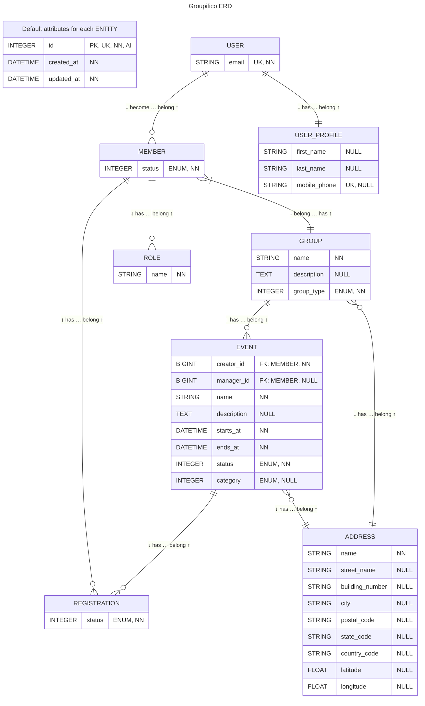
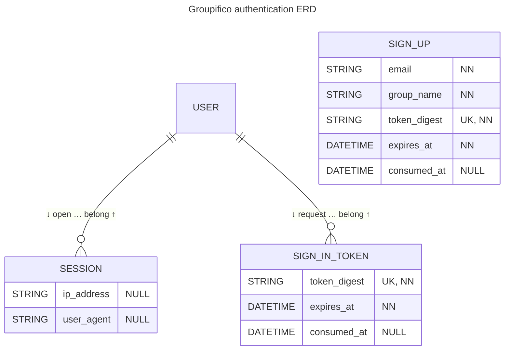

# What is Groupifico?

Groupifico is an online place where you can manage the essential chores of your group. 😊

Your group being:
1) **CHOIR**
2) **BAND**
3) Or any other **GROUP** of people doing something together

## What chores?

Groupifico is strictly focused on managing fundamental parts of your group:

- Members
- Events

_Coming soon:_
- Links
- Notifications
- Documents (e.g. Songbook)
- Polls (quick and easy feedback)
- Membership fees (Treasury)

For more information, check out the [backlog](https://github.com/izkreny/groupifico/issues/84).

## Architecture

### Web framework

- Plain and simple Ruby on Rails web app with mobile first interface
- ERB + partials + layout
- DaisyUI

### Core Domain Models

#### Group
- Multi-tenancy is achieved via Groups

#### User
- Global application identity via unique email
- User signs in by asking for a link at their email address and pressing the button on the page it opens, and the session persists until signed out
- User can become a Member of one or more Groups

#### Member aka _Group membership_
- Members belong to the Group, have a status, and hold any number of roles
- They can create/interact with Events, Polls, etc.
- What a status and a role each permit is [the authorization model](./docs/AUTHORIZATION.md), which holds the capability tables and the two questions every request asks

#### Event
- Main organizational group entity

#### Registration
- Member registers for an Event
- Member can be invited to an Event and respond
- A registration can be reserved and the presence later confirmed

### Other Domain Models

#### Address
- Fields according to [ISO 20022 PostalAddress type](https://www.iso20022.org/standardsrepository/type/PostalAddress28)

### Entity Relationship Diagram

The diagram renders only what is needed to read the schema: entity, attribute, type, key and nullability. Everything else about a column, its limit, its enum options, its default and its foreign key rules, sits in a `%%` comment in the source of this file directly above the line it describes, and never reaches the picture. So read the rendered diagram for the shape, the source of this section for the detail, and the Rails [schema.rb](./db/schema.rb) for the authority.

Attributes read `type name "key, comment"`: type before name, which is mermaid's own order, with the keys inside the comment rather than as native mermaid keys so that every entity box stays two columns wide. The reasoning behind that and every other choice here is [ADR 0002](./docs/adr/2026-08-21_erd-notation-conventions_0002.md).

| Token | Meaning |
|---|---|
| `PK` | Primary key |
| `UK` | Unique key |
| `FK: ENTITY` | Active Record reference to that entity, shown only where no relationship line does. Not necessarily a database constraint |
| `ENUM` | Integer column backed by an Active Record enum; its options and default are in the `%%` comment above it |
| `NN` | `NOT NULL`, the column is required |
| `NULL` | The column is nullable |
| `AI` | Auto-increment |

> [!IMPORTANT]
> - Foreign key attributes are omitted where a relationship line already shows the link. `creator_id` and `manager_id` are the exception, because both point at `MEMBER` so their names cannot say where they point, and neither has a database constraint behind it.
> - No authentication table is drawn here. `sessions`, `sign_in_tokens` and `sign_ups` have a diagram of their own, [below](#authentication-entity-relationship-diagram), rather than crowding this one, so what is left here is the domain.
> - Column limits are Rails-level facts. SQLite does not enforce a declared length, so a limit is what the model validations are set from and what a move to another database engine would need, not a constraint the database applies.
> - `MEMBER 1+ to 1 GROUP` is what the create path guarantees, not what the database enforces. A group is created with its creator as an `owner` member, so it never starts empty; nothing stops the last member being removed afterwards, and no constraint or validation upholds the `1+`.

```mermaid
---
title: Groupifico ERD
# IMPORTANT!
# - Official syntax for entity attributes is: `type name key "comment"`
# - Syntax for entity attributes used below: `type name "key, comment"`
---

erDiagram
  direction TB

  %% DEFAULT ATTRIBUTES
  "Default attributes for each ENTITY" {
    INTEGER  id         "PK, UK, NN, AI"
    DATETIME created_at "NN"
    DATETIME updated_at "NN"
  }

  %% RELATIONSHIPS
  USER    1   to  0+  MEMBER        :  "↓ become … belong ↑"
  USER    1   to  1   USER_PROFILE  :  "↓ has    … belong ↑"
  MEMBER  1+  to  1   GROUP         :  "↓ belong … has ↑"
  MEMBER  1   to  0+  ROLE          :  "↓ has    … belong ↑"
  GROUP   1   to  0+  EVENT         :  "↓ has    … belong ↑"
  EVENT   1   to  0+  REGISTRATION  :  "↓ has    … belong ↑"
  MEMBER  1   to  0+  REGISTRATION  :  "↓ has    … belong ↑"
  GROUP   0+  to  1   ADDRESS       :  "↓ has    … belong ↑"
  EVENT   0+  to  1   ADDRESS       :  "↓ has    … belong ↑"

  %% ENTITIES

  %% UNIQUE INDEX (email)
  %% FK: user_profiles and members reference users, ON DELETE CASCADE, ON UPDATE CASCADE
  %% FK: sessions and sign_in_tokens also reference users; their rules are in the authentication ERD below
  USER {
    %% email limit: 250 chars. Normalised to stripped lowercase, uniqueness validated case-insensitively
    STRING email "UK, NN"
  }

  %% UNIQUE INDEX (user_id), UNIQUE INDEX (mobile_phone)
  %% FK: user_id references users, ON DELETE CASCADE, ON UPDATE CASCADE
  USER_PROFILE {
    %% first_name limit: 250 chars
    STRING first_name   "NULL"
    %% last_name limit: 250 chars
    STRING last_name    "NULL"
    %% mobile_phone limit: 50 chars
    STRING mobile_phone "UK, NULL"
  }

  %% FK: address_id references addresses, ON DELETE RESTRICT, ON UPDATE CASCADE
  GROUP {
    %% name limit: 250 chars
    STRING  name        "NN"
    %% description limit: 100000 bytes at the column, validated at 25000 chars in the model
    TEXT    description "NULL"
    %% ENUM group_type options: general | choir | band. Default: choir
    INTEGER group_type  "ENUM, NN"
  }

  %% UNIQUE INDEX (user_id, group_id): a User cannot become a Member of the same Group twice
  %% FK: user_id and group_id both ON DELETE CASCADE, ON UPDATE CASCADE
  MEMBER {
    %% ENUM status options: active | paused | inactive. Default: active
    INTEGER status "ENUM, NN"
  }

  %% UNIQUE INDEX (member_id, name): a Member cannot hold the same Role twice
  %% FK: member_id references members, ON DELETE CASCADE, ON UPDATE CASCADE
  ROLE {
    %% name has no limit declared. Validated for inclusion in Role::NAMES: owner | administrator | events_administrator
    STRING name "NN"
  }

  %% FK: group_id ON DELETE CASCADE, address_id ON DELETE RESTRICT, both ON UPDATE CASCADE
  %% FK: creator_id and manager_id have no database constraint, they are Active Record associations only
  EVENT {
    BIGINT   creator_id  "FK: MEMBER, NN"
    BIGINT   manager_id  "FK: MEMBER, NULL"
    %% name limit: 250 chars
    STRING   name        "NN"
    %% description limit: 100000 bytes at the column, validated at 25000 chars in the model
    TEXT     description "NULL"
    DATETIME starts_at   "NN"
    %% ends_at is validated greater_than starts_at
    DATETIME ends_at     "NN"
    %% ENUM status options: unconfirmed | confirmed | concluded | canceled. Default: unconfirmed
    INTEGER  status      "ENUM, NN"
    %% ENUM category options: other | rehearsal | gig. Default: other
    INTEGER  category    "ENUM, NULL"
  }

  %% UNIQUE INDEX (member_id, event_id): a Member cannot register for the same Event twice
  %% FK: member_id and event_id both ON DELETE CASCADE, ON UPDATE CASCADE
  REGISTRATION {
    %% ENUM status options: reserved | invited | yes | maybe | no. Default: reserved
    INTEGER status "ENUM, NN"
  }

  %% Fields follow the ISO 20022 PostalAddress type
  ADDRESS {
    %% name limit: 250 chars
    STRING name            "NN"
    %% street_name limit: 250 chars
    STRING street_name     "NULL"
    %% building_number limit: 250 chars
    STRING building_number "NULL"
    %% city limit: 250 chars
    STRING city            "NULL"
    %% postal_code limit: 100 chars
    STRING postal_code     "NULL"
    %% state_code limit: 50 chars. ISO 3166-2 code
    STRING state_code      "NULL"
    %% country_code limit: 5 chars. ISO 3166-1 alpha-2 code
    STRING country_code    "NULL"
    FLOAT  latitude        "NULL"
    FLOAT  longitude       "NULL"
  }
```

### Authentication Entity Relationship Diagram

The tables the domain diagram above leaves out: `sessions`, `sign_in_tokens` and `sign_ups`. It is a second picture rather than a second convention, so the token legend and the `"Default attributes for each ENTITY"` block above both apply here unchanged, and so does the rule that the source carries what the picture does not. The mechanism these three tables implement, and every decision behind it, is [ADR 0004](./docs/adr/2026-08-31_passwordless-email-sign-in_0004.md).

> [!IMPORTANT]
> - `USER` renders with no attributes because it is only the anchor here. The domain diagram above draws it in full, and an entity with no block claims to show no columns, where one that listed `email` alone would claim to show all of them.
> - `SIGN_UP` has no relationship line because it has no foreign key. The row exists before the account does, and it reaches `users` by email value at redemption, through `User.find_or_create_by!`; mermaid has no attribute-level anchor to hang that on.
> - `SIGN_IN_TOKEN` and `SIGN_UP` repeat three columns because both models include the `Redeemable` concern, which owns them: each model gets its own HMAC-SHA256 digest, keyed off `secret_key_base` through a per-model key so the two tables draw from independent keyspaces, and `Redeemable::EXPIRES_IN` is fifteen minutes. The `%%` lines below name what owns each fact rather than restating its value, so there is one place to change either.
> - A link is spent by a conditional `UPDATE` that sets `consumed_at`, never by deleting the row, so both token tables keep the record of what was issued.
> - `sessions` has no cascade behind it. Its foreign key is declared with no options, so the database does `NO ACTION`, and `User has_many :sessions, dependent: :destroy` is the whole of the cleanup.

```mermaid
---
title: Groupifico authentication ERD
# IMPORTANT!
# - Official syntax for entity attributes is: `type name key "comment"`
# - Syntax for entity attributes used below: `type name "key, comment"`
---

erDiagram
  direction TB

  %% RELATIONSHIPS
  %% SIGN_UP has none: it carries no user_id, so there is nothing to draw a line from
  USER  1  to  0+  SESSION        :  "↓ open    … belong ↑"
  USER  1  to  0+  SIGN_IN_TOKEN  :  "↓ request … belong ↑"

  %% ENTITIES

  %% USER is drawn in full in the domain ERD above; it is the anchor here and nothing more
  %% FK: sessions and sign_in_tokens both reference users, with the rules noted on each below

  %% FK: user_id references users with no options, so NO ACTION; has_many dependent: :destroy cleans them up
  SESSION {
    %% ip_address has no limit declared
    STRING ip_address "NULL"
    %% user_agent has no limit declared
    STRING user_agent "NULL"
  }

  %% UNIQUE INDEX (token_digest)
  %% FK: user_id references users, ON DELETE CASCADE, ON UPDATE CASCADE
  SIGN_IN_TOKEN {
    %% token_digest has no limit declared. Written and matched by SignInToken.digest, never the token
    STRING   token_digest "UK, NN"
    %% expires_at is set at mint to Redeemable::EXPIRES_IN from now
    DATETIME expires_at   "NN"
    %% consumed_at is null until the link is spent. The outstanding scope selects those still null
    DATETIME consumed_at  "NULL"
  }

  %% UNIQUE INDEX (token_digest)
  %% No foreign key and no user_id: the row predates the account it creates
  SIGN_UP {
    %% email limit: 250 chars. Normalised to stripped lowercase, matching User exactly
    STRING   email        "NN"
    %% group_name limit: 250 chars. Becomes the new Group's name at redemption
    STRING   group_name   "NN"
    %% token_digest has no limit declared. Written and matched by SignUp.digest, never the token
    STRING   token_digest "UK, NN"
    %% expires_at is set at mint to Redeemable::EXPIRES_IN from now
    DATETIME expires_at   "NN"
    %% consumed_at is null until the link is spent. The outstanding scope selects those still null
    DATETIME consumed_at  "NULL"
  }
```
