# What is Groupifico?

Groupifico is an online place where you can manage essential chores of your group. 😊

Your group being:
1) **CHOIR**
2) **BAND**
3) Football, poker, or a chess **TEAM**
4) Or any other **GROUP** of people doing something together

## What chores?

Groupifico is strictly focused on fundamental parts of your group:

- MVP:
  - Members
  - Events
- Later:
  - Links
  - Notifications
  - Documents (e.g. Songbook)
  - Polls (quick and easy feedback)
  - Membership fees (Treasury)

_Maybe?_

- Comments / Notes
- Files / Attachments
- Other Documents (e.g. Articles / Posts)

## Architecture

### Web framework

- Plain and simple Ruby on Rails web app with mobile first interface
- ERB + partials + layout
- DaisyUI

_Maybe?_
- Snappy Rails PWA with push notifications via Hotwire
- Later:
  - ViewComponents
  - Hotwire Native mobile app
  - Integrated PM or Chat?!?

### Core Domain Models

#### Group
- Multi-tenancy is achieved via Groups

#### User
- Global application identity via unique email and mobile phone
- User can login to the app via magic link/code sent to email
- User can become a Member of one or more Groups

_Maybe?_
- Login via Google Account and/or Passkey
- Login with code sent to mobile phone via SMS
- Add more fields via (Groups?) Profile(s)
  - [Get](https://stackoverflow.com/a/37512371/21188433) Time Zone from [browser](https://developer.mozilla.org/en-US/docs/Web/JavaScript/Reference/Global_Objects/Intl/DateTimeFormat/resolvedOptions)
- Soft delete (anonymize)

#### Member aka _Group membership_
- Members belong to the Group and have status and roles
- They can create/interact with Events, Polls, etc.

_Maybe?_
- Start / end date of membership
- Membership history
- Multiple roles aka role system based on modules

#### Event
- Main organizational group entity
- Only (event) admin can create events

_Maybe?_
- Deadline for RSVP (status)
- Duplicate event
- Later:
  - Reccuring events
  - Attachments or links to other entities e.g. Songs, File uploads?
  - Belong to season (either whole year or some specifit date range)
  - iCalendar one-way sync
  - Status workflow (rules)

#### Attendee
- Member can attend an Event
- Member can be invited and respond
- Attendance can be reserved and presence later confirmed

_Maybe?_
- Track RSVP (status) changes...

### Other Domain Models

#### Address
- Fields according to [ISO 20022 PostalAddress type](https://www.iso20022.org/standardsrepository/type/PostalAddress28)
- Later:
  - Use Geocoding JavaScript frontend library or [geocoder gem](https://github.com/alexreisner/geocoder) (via Hotwire?) to automatically parse address in free-form and fill **ALL** possible ISO 20022 fields.
  - Provide as well visual map
  - Incorporate Country info via https://github.com/countries/countries

_Maybe?_

#### Links
- For group menu/linktree page
- For social links for group and user profiles
- Fields:
  - Name
  - URL
  - url_type (for icons) - maybe allow user to select custom icon? Or just make it easy to place emoji or icon inside te name field?! Or make separate feature depending it is linktree or social links, maybe based on link_type enum?
  - color (only for linktree feature?!) e.g. primary, secondary, info, warning...

_Maybe?_
- Implement statistics

#### Song

- Song should have following basic fields:
  - Title
  - Lyrics
  - Notes

_Maybe?_
- Extra fields:
  - Duration
  - Key
  - Author
  - Arrangement
- Attachments

#### Polls
- Upcoming events (when more dates are considered)
- All other kinds of stuff

#### Treasury
- Membership fees

### Maybe?
- Translations aka il8n
- Comments
- Seasons
- Reports
  - For ZAMP!!!
- Attachments
- Dashboard
- Later:
  - Tasks

### Entity Relationship Diagram

In order to have nice and simple overview of a database schema, only basic information is provided below inside the Mermaid ERD, with the following important notes:

- Official syntax for entity attributes is: `type name key "comment"`
- Syntax for entity attributes used below: `name TYPE "key + comment"`
- Foreign key attributes are ommited if visible relationships exists

For more details you can check more comprehensive database schema in DBML syntax or check out the Rails [schema.rb](./db/schema.rb) file.

```mermaid
---
title: Groupifico ERD
# IMPORTANT NOTES:
# - Official syntax for entity attributes is: `type name key "comment"`
# - Syntax for entity attributes used below: `name TYPE "key + comment"`
# - Foreign key attributes are ommited if visible relationships exists
---


erDiagram
  direction TB
  %% DEFAULT ATTRIBUTES
  "DEFAULT attributes for each ENTITY" {
    id         INTEGER  "PK, UK"
    created_at DATETIME
    updated_at DATETIME
  }

  %% RELATIONSHIPS
  USER   1  to 1+ MEMBER       : "↓ become … belong ↑"
  USER   1  to 1  USER_PROFILE : "↓ has    … belong ↑"
  MEMBER 1+ to 1  GROUP        : "↓ belong … has ↑"
  GROUP  1  to 1+ EVENT        : "↓ has    … belong ↑"
  EVENT  1  to 1+ ATTENDEE     : "↓ has    … belong ↑"
  MEMBER 1  to 1+ ATTENDEE     : "↓ become … belong ↑"
  GROUP  0+ to 1  ADDRESS      : "↓ has    … belong ↑"
  EVENT  0+ to 1  ADDRESS      : "↓ has    … belong ↑"

  %% ENTITIES
  USER {
    email STRING "UK"
  }

  USER_PROFILE {
    username     STRING "UK"
    first_name   STRING
    last_name    STRING
    time_zone    STRING
    mobile_phone STRING "UK"
  }

  GROUP {
    username    STRING "UK"
    name        STRING
    description TEXT
    time_zone   STRING
    group_type  INTEGER "ENUM"
  }

  MEMBER {
    status INTEGER "ENUM"
    role   INTEGER "ENUM"
  }

  EVENT {
    creator_id  INTEGER "FK: MEMBER"
    manager_id  INTEGER "FK: MEMBER"
    uid         STRING "UK: GROUP"
    name        STRING
    description TEXT
    start       DATETIME
    end         DATETIME
    time_zone   STRING
    status      INTEGER "ENUM"
    event_type  INTEGER "ENUM"
  }

  ATTENDEE {
    status INTEGER "ENUM"
  }

  ADDRESS {
    name            STRING
    street_name     STRING
    building_number STRING
    city            STRING
    postal_code     STRING
    state_code      STRING
    country_code    STRING
    latitude        FLOAT
    longitude       FLOAT
  }
```

