# What is Groupifico?

Groupifico is an online place where you can manage essential chores of your group. 😊

Your group being:
1) **CHOIR**
---
2) **BAND**
3) Football, poker, or a chess **TEAM**
4) Or any other **GROUP*- of people doing something together

## What chores?

Groupifico is strictly focused on fundamental parts of your group:

- Members
- Events
---
- Notifications
- Documents (e.g. Songbook)
- Polls (quick and easy feedback)
- Membership fees (Treasury)

_Maybe?_

- Comments / Notes
- Files / Attachments
- Other Documents (e.g. Articles / Posts)

## Architecture

### Web framework

- Plain and simple Ruby on Rails web app with mobile first interface
  - ERB + partials + layout
  - DaisyUI

_Maybe?_
- Snappy Rails PWA with push notifications via Hotwire
---
- ViewComponents
- Hotwire Native mobile app
- Integrated PM or Chat?!?

### Core Domain Models

#### Group
- Multi-tenancy is achieved via Groups

#### User
- Global application identity via unique email and mobile phone
- User can login to the app via magic link/code sent to email
- User can become a Member of one or more Groups

_Maybe?_
- Login via Google Account and/or Passkey
- Login with code sent to mobile phone via SMS
- Add more fields via (Groups?) Profile(s)
- Soft delete (anonymize)

#### Member --> Group membership
- Members belong to the Group and have status and roles
- They can create/interact with Events, Polls, etc.

_Maybe?_
- Start / end date of membership
- Membership history
- Multiple roles aka role system based on modules

#### Event
- Main organizational group entity
- Only (event) admin can create events

_Maybe?_
- Deadline for RSVP (status)
- Duplicate event
---
- Reccuring events
- Attachments or links to other entities e.g. Songs, File uploads?
- Belong to season (either whole year or some specifit date range)
- iCalendar one-way sync
- Status workflow (rules)

#### ATTENDEE
- Member can attend an Event
- Member can be invited and respond
- Attendance can be reserved and presence later confirmed
---
- Track RSVP (status) changes...

### Other Domain Models

#### Songbook

- Song should have following basic fields:
  - Title
  - Lyrics
  - Notes

_Maybe?_
- Extra fields:
  - Duration
  - Key
  - Author
  - Arrangement
- Attachments

#### Polls
- Upcoming events (when more dates are considered)
- All other kinds of stuff

#### Treasury
- Membership fees

### Maybe?
- Translations aka il8n
- Comments
- Seasons
- Reports
  - For ZAMP!!!
- Attachments
- Dashboard
---
- Tasks

### Entity Relationship Diagram

```mermaid
---
title: Groupifico ERD
config:
  layout: elk
---

erDiagram
    direction TB
    USER   1  to 1+ MEMBER   : "↓ become … belong ↑"
    MEMBER 1+ to 1  GROUP    : "↓ belong … has ↑"
    GROUP  1  to 1+ EVENT    : "↓ has    … belong ↑"
    EVENT  1  to 1+ ATTENDEE : "↓ has    … belong ↑"
    MEMBER 1  to 1+ ATTENDEE : "↓ become … belong ↑"
    GROUP  1+ to 1  ADDRESS  : "↓ has    … belong ↑"
    EVENT  1+ to 1  ADDRESS  : "↓ has    … belong ↑"

    USER {
        uid          STRING "UK"
        first_name   STRING
        last_name    STRING
        email        STRING "UK"
        mobile_phone STRING "UK"
    }

    GROUP {
        uid         STRING "UK"
        name        STRING
        description TEXT
        group_type  STRING "ENUM"
    }

    MEMBER {
        status STRING "ENUM"
        role   STRING "ENUM"
    }

    EVENT {
        uid         STRING
        creator_id  INTEGER "FK: MEMBER"
        manager_id  INTEGER "FK: MEMBER"
        name        STRING
        description TEXT
        start       DATETIME
        end         DATETIME
        status      STRING "ENUM"
        event_type  SRING "ENUM"
    }

    ATTENDEE {
        status STRING "ENUM"
    }

    ADDRESS {
        name STRING
        %% Add other details as city, country, street, etc.
        %% Implement later geo coordinates aka location
    }
```

