```mermaid
---
title: Groupifico ERD
# IMPORTANT NOTES:
# - Official syntax for entity attributes is: `type name key "comment"`
# - Syntax for entity attributes used below: `name TYPE "key + comment"`
# - Foreign key attributes are ommited if visible relationships exists
---


erDiagram
  direction TB
  %% DEFAULT ATTRIBUTES
  "DEFAULT attributes for each ENTITY" {
    id         INTEGER  "PK, UK"
    created_at DATETIME
    updated_at DATETIME
  }

  %% RELATIONSHIPS
  USER   1  to 1+ MEMBER       : "↓ become … belong ↑"
  USER   1  to 1  USER_PROFILE : "↓ has    … belong ↑"
  MEMBER 1+ to 1  GROUP        : "↓ belong … has ↑"
  GROUP  1  to 1+ EVENT        : "↓ has    … belong ↑"
  EVENT  1  to 1+ ATTENDEE     : "↓ has    … belong ↑"
  MEMBER 1  to 1+ ATTENDEE     : "↓ become … belong ↑"
  GROUP  0+ to 1  ADDRESS      : "↓ has    … belong ↑"
  EVENT  0+ to 1  ADDRESS      : "↓ has    … belong ↑"

  %% ENTITIES
  USER {
    email STRING "UK"
  }

  USER_PROFILE {
    username     STRING "UK"
    first_name   STRING
    last_name    STRING
    time_zone    STRING
    mobile_phone STRING "UK"
  }

  GROUP {
    username    STRING "UK"
    name        STRING
    description TEXT
    time_zone   STRING
    group_type  INTEGER "ENUM"
  }

  MEMBER {
    status INTEGER "ENUM"
    role   INTEGER "ENUM"
  }

  EVENT {
    creator_id  INTEGER "FK: MEMBER"
    manager_id  INTEGER "FK: MEMBER"
    uid         STRING "UK: GROUP"
    name        STRING
    description TEXT
    start       DATETIME
    end         DATETIME
    time_zone   STRING
    status      INTEGER "ENUM"
    event_type  INTEGER "ENUM"
  }

  ATTENDEE {
    status INTEGER "ENUM"
  }

  ADDRESS {
    name            STRING
    street_name     STRING
    building_number STRING
    city            STRING
    postal_code     STRING
    state_code      STRING
    country_code    STRING
    latitude        FLOAT
    longitude       FLOAT
  }
```

# What is Groupifico?

Groupifico is an online place where you can manage the essential chores of your group. 😊

Your group being:
1) **CHOIR**
2) **BAND**
3) Or any other **GROUP** of people doing something together

## What chores?

Groupifico is strictly focused on managing fundamental parts of your group:

- Members
- Events

_Coming soon:_
- Links
- Notifications
- Documents (e.g. Songbook)
- Polls (quick and easy feedback)
- Membership fees (Treasury)

For more information, check out the detailed [roadmap](./docs/ROADMAP.md).

## Architecture

### Web framework

- Plain and simple Ruby on Rails web app with mobile first interface
- ERB + partials + layout
- DaisyUI

### Core Domain Models

#### Group
- Multi-tenancy is achieved via Groups

#### User
- Global application identity via unique email
- User can login to the app via magic link/code sent to email
- User can become a Member of one or more Groups

#### Member aka _Group membership_
- Members belong to the Group and have status and role
- They can create/interact with Events, Polls, etc.

#### Event
- Main organizational group entity

#### Attendee
- Member can attend an Event
- Member can be invited and respond
- Attendance can be reserved and presence later confirmed

### Other Domain Models

#### Address
- Fields according to [ISO 20022 PostalAddress type](https://www.iso20022.org/standardsrepository/type/PostalAddress28)

### Entity Relationship Diagram

To have a clear and simple overview of an application architecture, only basic information is provided. For more details, you can refer to the comprehensive database schema in [DBML syntax](./docs/schema.dbml) or review the Rails [schema.rb](./db/schema.rb) file.

> [!IMPORTANT]  
> - Foreign key attributes are omitted if visible relationships exist

