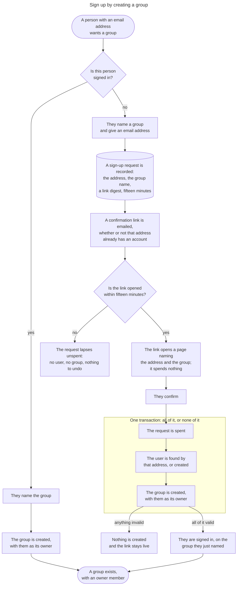

> 🤖 Written by AI --- read/modified by izkreny! 🤓

# Sign up by creating a group

Implementation plan for [#207](https://github.com/izkreny/groupifico/issues/207). The acceptance criteria live on the issue; this file answers how.

## Context

There is no sign-up page. `UsersController#new` and `#create` are what a signed-in user reaches through `resource :user`, and nothing signed out reaches an account at all: `_navigation.html.erb` offers "Log in" and nothing else. #139 landed the passwordless flow this builds on, so `sign_in_tokens`, `SignInsController` and the confirmation page all exist and work.

The sign-in mechanism and every decision behind it are [ADR 0004](../adr/2026-08-31_passwordless-email-sign-in_0004.md). This plan cites it and does not restate it.

## The flow

Both routes to a group, and what exists at each point along them. The fork is whether this person is signed in, since a session is what proves the address is theirs, and that is what decides whether anything can be written before a link comes back.

## Decisions

**A pending sign-up is a request to start a group, so it gets a table of its own.** `sign_ups` holds the address and the group name, which are domain facts a credential table has no business carrying. It also has to hold them somewhere durable: the click may land on a different device, so the browser session cannot carry the group name, and `Session` cannot either, because that row exists only once sign-in has succeeded.

**`sign_in_tokens` is untouched, and `user_id` stays `null: false`.** That is what lets `SignInToken.redeem!` rely on `.user` unconditionally and every finder there keep one meaning, with no purpose to scope by and no branch in `SignInsController`.

**Nothing is written until the address is proven.** `users.email` is unique, so a row written for an unproven address would either occupy a real person's address before they ever asked for an account, or force the form to answer differently on a duplicate and so report whether an address is already registered. Deferring every write until the link is confirmed is what avoids both.

**These invariants are stated on the model, because nothing upstream enforces them.** No Rails facility covers a token that belongs to no record: `ActiveRecord::TokenFor` builds its payload as `[model.id, block.as_json]` and re-derives the record from `payload[0]`, so a framework token always names a row that already exists. `SignUp` therefore validates its own domain columns and normalizes its address rather than inheriting a guarantee from anywhere.

**One credential mechanism, in two tables.** ADR 0004's fifteen minutes is "the only window in the application", so both rows share it, along with the HMAC digest scheme and the single-statement spend, through a model concern rather than a second copy. What is not shared is the key label: `key_generator.generate_key` is called with a label derived from the model name, so the two tables have independent keyspaces. Nothing exploits a shared one, since every lookup is already confined to its own table, but independent is the right default and costs a string.

**The extraction is a behaviour-preserving step of its own.** Moving the digest, the mint and the conditional `UPDATE` off `SignInToken` and into the concern changes no behaviour and lands separately from anything that does, with the existing `spec/models/sign_in_token_spec.rb` green across it. Fowler's rule, and the reason it is worth the discipline here is that the code being moved is the part ADR 0004 spends four sections on.

**Confirmation is one transaction that contains the spend.** The conditional `UPDATE` goes inside `transaction do` alongside the three creates, so a validation failure rolls the spend back and leaves the link live for a retry rather than burning it. Two concurrent confirmations resolve the way ADR 0004 describes: the `UPDATE`'s row count is the only arbiter and there is no separate read to race against.

**Confirming one sign-up does not consume the address's other outstanding rows.** Two rows for one address carry two different group names and two different intents, so confirming the first must not silently discard the second. The user's *sign-in* tokens are consumed on confirmation exactly as `redeem!` does it, because by then there is a session.

**The owner membership lives on `Group`, called by both creation paths.** `GroupsController#create` and `SignUp.redeem!` write the same membership for different users, so the method takes the user explicitly and reaches for no `Current`. It uses `Role::OWNER`, which `Group#owned_by_anyone_but?` already uses.

**`GroupsController#new` and `#create` are kept, and the two paths divide by whether a user exists.** Sign-up defers creation because there is no user yet and nobody has proven they control the address; `groups#create` defers nothing, because the session is that proof. So they are not two doors to one outcome: one creates an account around a first group, the other creates a group for an account that already exists. `docs/AUTHORIZATION.md` gains a second act rather than a second door, and `GroupPolicy#create?` keeps sole ownership of the one authorization question, because signing up raises none until it has created the actor that could ask.

**Two singular resources, mirroring the sign-in pair.** The form and the emailed link stay split the way `resource :session` and `resource :sign_in` are split, because asking for a link and redeeming one are different actions with different guards.

**The shared parts of redemption become a controller concern rather than a second copy.** `hold_token_from_query_string` is where ADR 0004's "the emailed link never authenticates" is actually implemented, along with the reason the page names the account: a link nobody sent you is otherwise indistinguishable from your own. Two callers is early for an extraction, and this one is taken anyway because what would be duplicated is the security measure.

**The sign-up form is rate limited, and for a reason `sessions#create` does not have.** That action mails only an address with an account; this one mails any address given to it, so it is a mail-bombing vector as well as a brute-force one. The limit is keyed on the submitted address alongside the IP.

**The mint happens in the mailer.** `SignInMailer#link` mints there so `deliver_later` serialises a global id rather than writing a raw token into `solid_queue_jobs.arguments`. The sign-up mail carries the address and the group name, neither of which is secret, so the same shape holds and the fifteen minutes start when the mail is built.

## Out of scope

- **The sweep ADR 0004 says is owed.** The row-per-request choice accepted that rows accumulate, and `sign_ups` accumulates the same way for the same reason. No issue exists for it and no criterion here asks.
- **Approval of a new group by an app-scoped administrator.** No issue exists, and every name in `Role::NAMES` is group-scoped, so it needs an authorization axis this application does not have. Worth knowing for whoever builds it: a `sign_ups` row is already the request such a step would approve, so approval is a state column here rather than a flag on `groups` and a hidden-group scope threaded through every policy, and `groups#create` gains an approval gate rather than disappearing, since a signed-in owner asking for a fourth group is exactly who an approver wants in the queue. Which order it takes is open, because the two orders want different columns: confirm-then-approve keeps the row as shaped and gives the confirmation page nobody to sign in, while approve-then-confirm mints the token late and needs `token_digest` and `expires_at` nullable.
- **The authentication ERD.** `README.md:80` records that neither `sessions` nor `sign_in_tokens` is drawn in the main diagram and that they get one of their own; `sign_ups` joins them as undrawn. Adding a table nothing draws changes no diagram.
- **`SessionsController::LINK_SENT`.** ADR 0004's "It names one of those two ways and not both" is a deliberate choice about who reaches that form, and this branch is not the occasion to reopen it.

## Steps

- Extract the shared credential mechanism off `SignInToken` into a model concern: the HMAC digest with a key label derived from the model name, `EXPIRES_IN`, the mint, the `outstanding` scope, `InvalidToken`, and the conditional `UPDATE` as a `spend!` returning the row. Behaviour preserving, its own commit, with `spec/models/sign_in_token_spec.rb` green across it
- Migrate `create_table :sign_ups`: `email` (string, limit 250, `null: false`), `group_name` (string, limit 250, `null: false`), `token_digest` (string, `null: false`, unique index), `expires_at` (`null: false`), `consumed_at` (nullable), timestamps. No foreign key, because the point of the row is that no user exists yet
- Add `SignUp` on the concern, with `normalizes :email` matching `User`'s so confirmation compares one spelling, and presence and length validations on both domain columns
- Add `SignUp.redeem!`: one transaction holding `spend!`, `User.find_or_create_by!(email:)`, the group and its owner membership, so a failure anywhere leaves the link live and no records behind, and consume the user's outstanding sign-in tokens once there is a session
- Move the owner membership onto `Group`, taking the user explicitly, and call it from both `GroupsController#create` and `SignUp.redeem!`
- Add `SignUpsController` (`new`, `create`) behind `resource :sign_up, only: %i[ new create ]`, with `allow_unauthenticated_access`, `refuse_authenticated`, `skip_verify_authorized`, the rate limit keyed on the address and the IP, and a response identical whether or not the address already has an account
- Add `SignUpConfirmationsController` (`show`, `create`) behind `resource :sign_up_confirmation, only: %i[ show create ]`, with the same guards, and extract the token-from-query-string handling it shares with `SignInsController` into a controller concern
- Add `SignUpMailer#link` and its two views; the mail names the group and the fifteen minutes, and the mailer mints
- Add the two views: the form asking for a group name and an address, and a confirmation page naming both the address and the group before its button, for the reason `hold_token_from_query_string`'s comment gives about a planted link
- Link the form from `_navigation.html.erb` beside "Log in", so a signed-out visitor can reach it
- Retire `UsersController#new` and `#create`: narrow `resource :user` to `%i[ show edit update destroy ]`, shrink the `skip_verify_authorized` list, rewrite the comment whose second paragraph argues about exactly those two actions, and delete `app/views/users/new.html.erb`. Check first whether Action Policy's `skip_verify_authorized` is a `skip_after_action`, which `raise_on_missing_callback_actions` would make a boot failure if the named actions are gone. `app/views/users/_form.html.erb` stays, because `edit` renders it
- Rewrite the "Starting a group is not a membership question and has no row" paragraph in `docs/AUTHORIZATION.md` so it names both acts: starting a group as a signed-in user is the authorization question `GroupPolicy#create?` answers, and signing up is an account-creation route whose side effect is a first group, raising no authorization question at all. Align `GroupPolicy`'s header comment with it
- Specs, per `.agents/testing.md`: `spec/models/sign_up_spec.rb` for the validations, the expiry and the transaction's all-or-nothing; `spec/requests/sign_ups_spec.rb` and `spec/requests/sign_up_confirmations_spec.rb` covering every action in both signed-in and signed-out contexts; the retired examples out of `spec/requests/user_spec.rb`; and a `sign_ups` factory

## Verification

- `bin/ci`

Each new check is watched failing before it is trusted: the transaction, against a version that spends outside it, so an invalid group leaves a burnt link; the two key labels, against a version deriving one label for both models, so a `sign_ups` digest and a `sign_in_tokens` digest stop being independent; and the expiry, against a row whose `expires_at` is in the past.

What that gate cannot see: whether the confirmation page reads as the deliberate last step of signing up rather than as an extra hoop, whether naming both the address and the group there reads as a safety check rather than as noise, and whether a "Start a group" link sitting beside "Log in" reads as an invitation rather than as a second login. All three are judgements in a browser.

## Open questions

None.

## Settled

None. The decisions this branch rests on are stated in `## Decisions` above.
